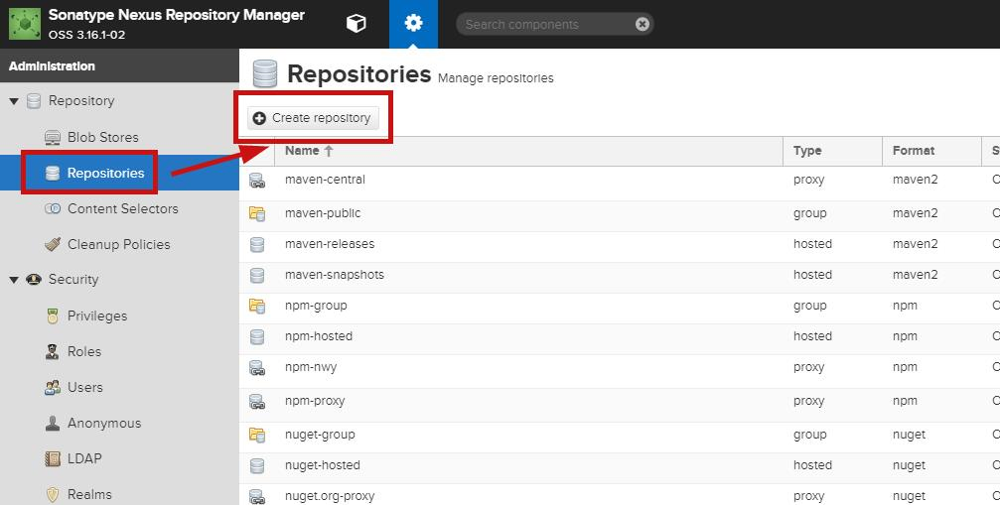
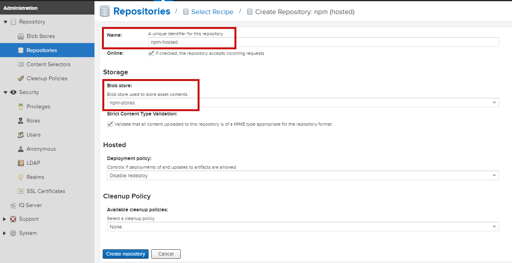
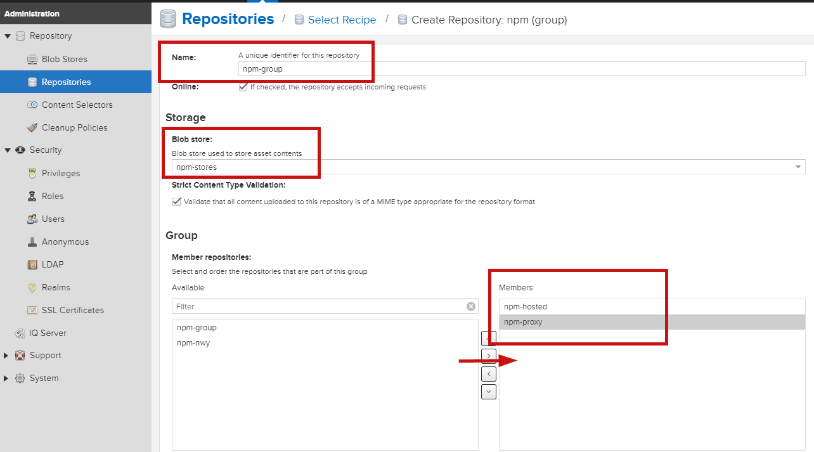
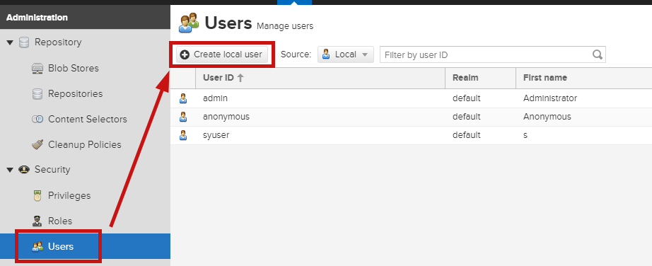
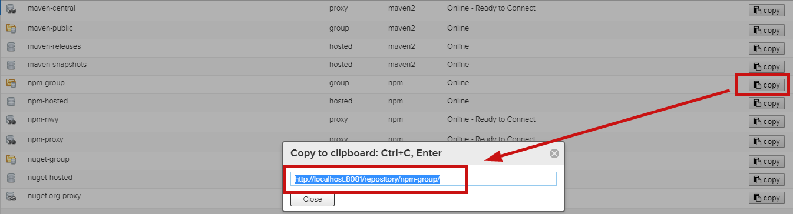

> npm 本地镜像

``` bash

yum install java

yum install maven

nexus run
# 启动端口默认在8081
# 默认用户名admin 密码admin123
```

> 创建存储空间


> 创建仓库

hosted（私有仓库）：用于发布个人开发的npm组件

proxy（代理仓库）：可以代理npm和淘宝镜像

group（组合仓库）：对外公开的仓库，集合了hosted和proxy







> 创建用户





> 用户端使用地址


